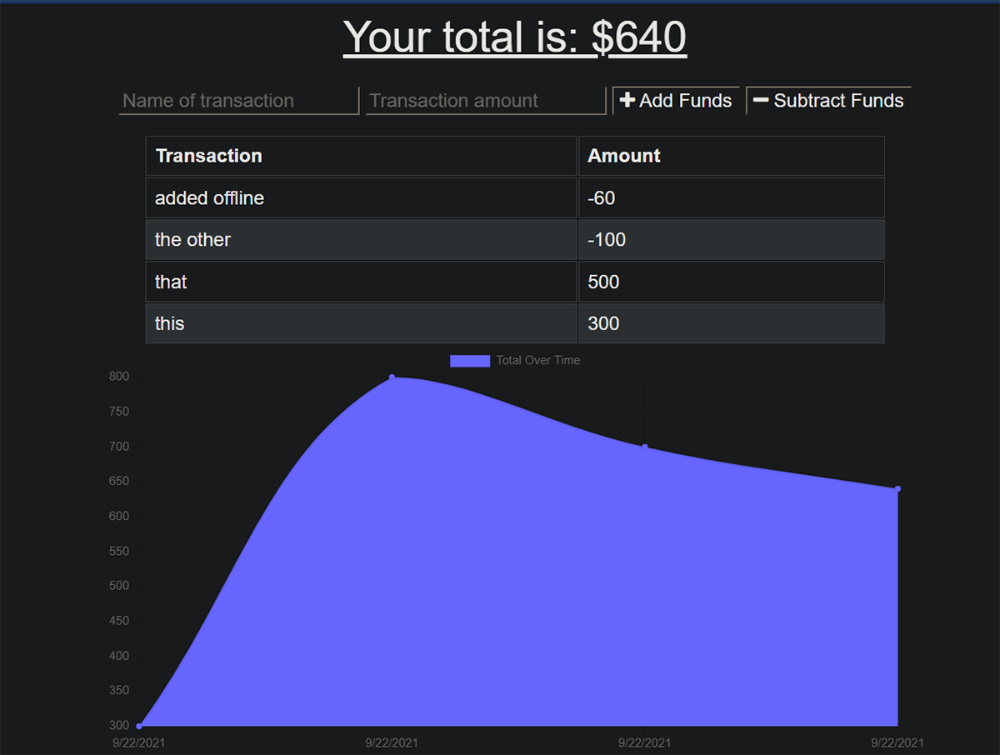

# Unit 19 PWA Homework: Online/Offline Budget Trackers

## Table of Contents

- [Description](#description)
- [Installation](#installation)
- [Usage](#usage)
- [Screenshots](#screenshots)
- [Heroku Link](#heroku-link)
- [Contact](#contact)

## Description

An web app used for tracking budget online and offline. Data added offline is cached to be added to database once device is online.

## Installation

This app requires the following dependencies:
- compression
- lite-server
- express
- mongoose
- dotenv
- morgan

## Usage

In the terminal, from the root folder, run with commands `npm i`, `npm run seed` and `npm start`. Then from a browser navigate to http://localhost:3000.

## Screenshots

Performance (lighthouse):

## Heroku Link
https://sheltered-ridge-02243.herokuapp.com/

## Contact

Mehalet KesateBirhan  
Github: https://github.com/MehaletKB 
email: tatybcoding@gmail.com
